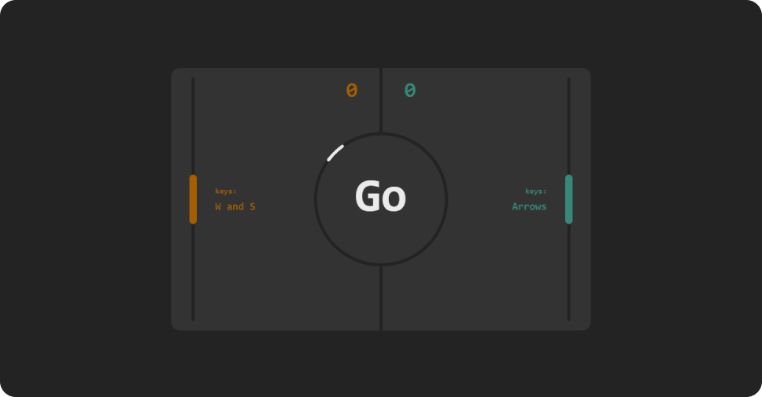
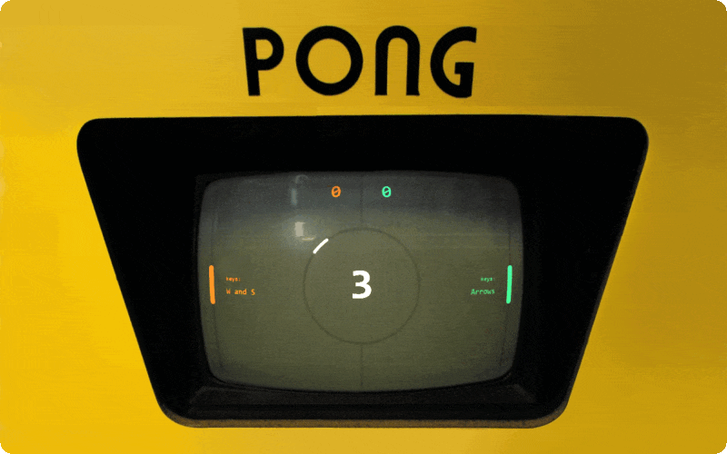

### Implementation of the Pong game in JavaScript.
⚠ So far, only for 2 players desktop gameplay (⚆_⚆)

You can play here:
https://buninman.github.io/Pong/

Code analysis with detailed explanations here:
https://blog.buninman.ru/pong
or here:
https://habr.com/ru/post/697870/

# What's new in the game?
1. New design of the playing field
2. New ball strike counter
3. The ball picks up speed with each hit
5. Platforms can hit the ball with an edge
6. Starting timer and random direction for the ball

# What's new in the code?
1. The ball no longer gets stuck in the platforms
2. The score is always displayed correctly, in its place
3. The ball never flies 45°. Does not get hung up on one path.
4. All settings in one JS file
5. The code has become simpler

⚠ To work, you need an http-server. I used Live Server Extension in Visual Studio Code

---

New Pong on display 1972🕹
